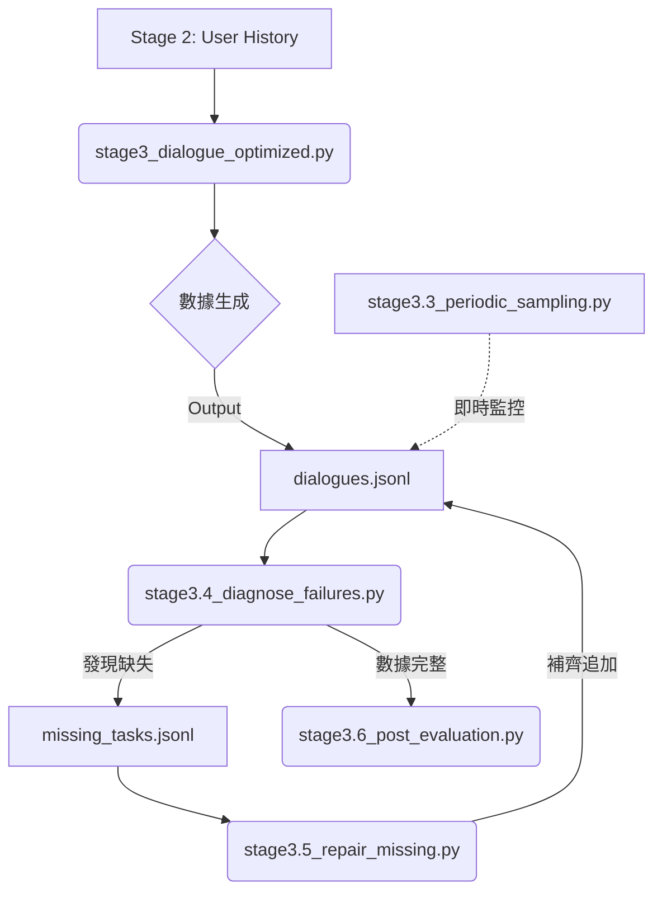

# 📘 Stage 3: 對話生成系統完整說明文件 (含執行報告)

## **目錄**

1. [整體流程概覽](https://www.google.com/search?q=%23%E6%95%B4%E9%AB%94%E6%B5%81%E7%A8%8B%E6%A6%82%E8%A6%BD)
2. [核心生成階段 (Stage 3)](https://www.google.com/search?q=%23%E6%A0%B8%E5%BF%83%E7%94%9F%E6%88%90%E9%9A%8E%E6%AE%B5-stage-3)
3. [診斷與修復階段 (Stage 3.4 & 3.5)](https://www.google.com/search?q=%23%E8%A8%BA%E6%96%B7%E8%88%87%E4%BF%AE%E5%BE%A9%E9%9A%8E%E6%AE%B5-stage-34--35)
4. [最終品質評估階段 (Stage 3.6)](https://www.google.com/search?q=%23%E6%9C%80%E7%B5%82%E5%93%81%E8%B3%AA%E8%A9%95%E4%BC%B0%E9%9A%8E%E6%AE%B5-stage-36)
5. [實驗與監控工具](https://www.google.com/search?q=%23%E5%AF%A6%E9%A9%97%E8%88%87%E7%9B%A3%E6%8E%A7%E5%B7%A5%E5%85%B7)
6. [執行順序建議](https://www.google.com/search?q=%23%E5%9F%B7%E8%A1%8C%E9%A0%86%E5%BA%8F%E5%BB%BA%E8%AD%B0)

---

## **整體流程概覽**

本階段目標為生成高品質、多樣化的音樂推薦對話數據。採用 **「生成 -> 診斷 -> 修復 -> 評估」** 的閉環流程，確保數據集的完整性與品質。

**流程圖：**



---

## **核心生成階段 (Stage 3)**

### **stage3_dialogue_optimized.py**

**功能：** 雙階段對話生成主程式（優化版）。負責大規模生成數據。

**核心特性：**

* **Persona Cache**：預先生成並儲存 Persona Snippet，減少 LLM 呼叫。
* **並行處理**：支援多 Worker 平行寫入。
* **斷點續傳**：自動跳過已完成的任務。

**實際執行結果：**

* 執行耗時約 X 小時，成功生成 84,151 首歌曲的基礎對話。(有多次修正、重新執行)
* 以下是最後一次執行最終的輸出顯示
```text
Synthesizing (Parallel): 100%|████████████████████| 84151/84151 [35:00:57<00:00,  1.50s/it]
2026-01-11 05:10:48,581 - INFO - Stage 3 Complete.

```

---

## **診斷與修復階段 (Stage 3.4 & 3.5)**

### **stage3.4_diagnose_failures.py**


**功能：** 檢測數據集完整性。確保每首歌都有 Positive/Exploratory/Negative 三種對話。

**實際執行結果：**

系統穩定性極高，缺失率僅 **0.01%** (30/252,453)，屬於正常誤差範圍。

```text
📊 統計結果：
   總歌曲數：84,151
   總對話數：252,423
   預期對話數：252,453

Checking completeness: 100%|███████████████| 84151/84151 [00:00<00:00, 1226900.99it/s] 

✅ 完整歌曲：84,121 (99.96%)
⚠️  不完整歌曲：30 (0.04%)
📝 缺失對話數：30

📈 缺失對話類型分布：
   Positive: 21 (70.0%)
   Exploratory: 8 (26.7%)
   Negative: 1 (3.3%)

🎯 評估與建議：
✅ 缺失率 0.01% < 1%，屬於正常範圍
   建議：執行補齊程式即可，不需修改主程式

```

---

### **stage3.5_repair_missing.py**


**功能：** 針對 `missing_tasks.jsonl` 進行定向補齊。

**修復策略：**

* **溫度提升 (0.85)**：增加創意，避免模型陷入重複迴圈。
* **重試次數 (5次)**：給予更多嘗試機會。
* **停用 Cache**：強制重新生成 Persona。

**實際執行結果：**

30 個缺失任務全部補齊成功，成功率 **100%**。耗時約 6 分鐘。

```text
2026-01-11 09:26:36,580 - INFO - 開始補齊（共 30 個任務）
補齊進度: 100%|███████████████████████████████████████| 30/30 [06:03<00:00, 12.12s/it]

2026-01-11 09:32:40,309 - INFO - 補齊完成
2026-01-11 09:32:40,309 - INFO - 成功：30
2026-01-11 09:32:40,309 - INFO - 失敗：0
2026-01-11 09:32:40,309 - INFO - 成功率：100.0%
2026-01-11 09:32:40,309 - INFO - 🎉 所有任務補齊成功！

```

---

## **最終品質評估階段 (Stage 3.6)**

### **stage3.6_post_evaluation.py**


**功能：** 採用 **歌曲級抽樣 (Song-based Sampling)** 進行最終品質評估。

**評估配置：**

* **樣本數**：1,000 首歌 (共 3,000 筆對話)。
* **評審模型**：`gemma3:12b`。
* **評分維度**：Overall, Coherence, Consistency, Naturalness, Instruction Following。

**實際執行結果：**

整體品質極高 (**Overall: 4.665**)，近 90% 的對話達到優秀水準 (>= 4.5)。

```text
================================================================================        
評估摘要 (Sample Size: 3,000)
================================================================================        

平均分數 (±標準差)：
  Overall:              4.665 ± 0.303
  Coherence:            4.545 ± 0.719
  Consistency:          4.977 ± 0.233
  Instruction Following: 4.992 ± 0.093

品質分佈：
  優秀 (≥ 4.5):       2,677 ( 89.2%)
  良好 (4.0-4.5):       220 (  7.3%)
  可接受 (3.5-4.0):      99 (  3.3%)
  不佳 (< 3.5):           4 (  0.1%)

各類型平均分數 (Overall)：
  Positive    : 4.879 (Instruction Following: 4.980)
  Exploratory : 4.734 (Instruction Following: 5.000)
  Negative    : 4.381 (Instruction Following: 4.996)

```

**結果分析：**

1. **一致性 (Consistency) 極高 (4.977)**：顯示模型能完美遵循 User Persona 設定。
2. **正向與探索對話表現優異**：分數均在 4.7 以上。
3. **負向對話略低但符合預期**：Negative 對話 (4.38) 因需處理用戶抱怨，自然度 (Naturalness) 挑戰較高，但指令遵循度 (4.996) 依然完美。

---

## **實驗與監控工具**

#### **stage3.1_experiment_model_selection.py**

* **目的**：論文實驗。比較不同 Small LLMs (如 Gemma, Llama, Mistral) 的生成效果。

#### **stage3.2_experiment_ablation.py**

* **目的**：消融實驗。驗證 Prompt 中 `CoT` (思維鏈) 與 `Reflection` (反思機制) 的貢獻度。

#### **stage3.3_periodic_sampling_eval.py**

* **目的**：即時監控。
* **機制**：在主程式執行期間，每 10,000 筆自動抽樣檢查。

---

## **執行順序建議**

為確保資料完整性，請嚴格按照以下順序執行：

1. **生成**：`python stage3_dialogue_optimized.py` (？h)
2. **診斷**：`python stage3.4_diagnose_failures.py` (10s)
3. **修復**：`python stage3.5_repair_missing.py` (6m)
4. **評估**：`python stage3.6_post_evaluation.py` (6.7h)

---

**文件版本：** v3.0 (Updated with Execution Logs)
**最後更新：** 2026-01-11